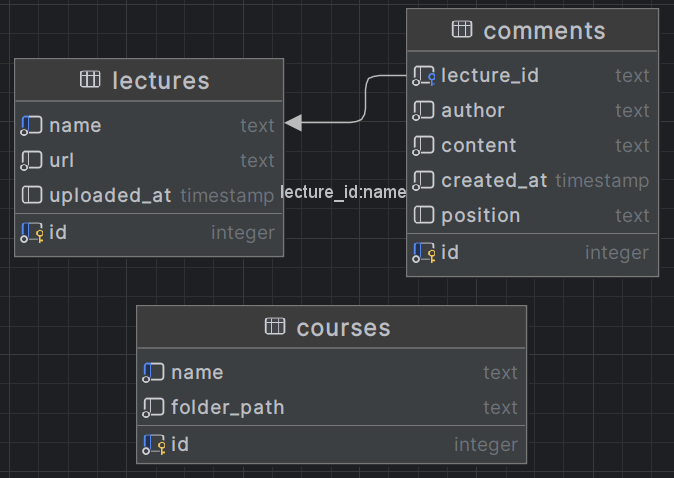

# Design report

# Architectural Design

目前的项目架构分为两个部分：

- 后端项目：主要包含 TypeScript 编写的业务逻辑（比如课程服务、数据库连接）和 Python 脚本
- 前端项目：基于 React + Vite + CSS，实现界面与用户交互

### 🔧 Architecture Diagram

```
+----------------+      VSCode Webview API      +-----------------+
|                |  <------------------------>  |                 |
|   Frontend     |                              |     Backend     |
|                |                              |                 |
+--------+-------+                              +--------+--------+
         |                                               |
         |                                               |
         v                                               v
+-------------------+                           +-----------------------+
| React Components  |                           |   Express / Node.js   |
| (Pages, API Hook) |                           |   (extension.ts,      |
| App.tsx           |                           | courseService.ts, etc)|
+-------------------+                           +-----------------------+
         |
         v
+----------------------------+
|  Vite, Tailwind, TypeScript|
+----------------------------+

```

### 📄 Natural Language Description

### 📌 系统概述

本系统采用**前后端分离架构**，前端使用 **React + Vite + CSS** 技术栈实现页面展示和用户交互；后端使用 **Node.js + TypeScript** 开发核心业务逻辑与数据处理，前后端通过VSCode提供的Webview API进行通信。部分功能如课件中的代码识别有借助 Python 实现辅助处理。

### 💡 前端模块（vite_test）

前端项目文件结构清晰、组件化开发，主要包含以下模块：

| `src/pages/` | 表示页面的跳转 |
| --- | --- |
| `src/components/` | 各个组件的呈现 |
| `App.tsx` | 程序主要入口 |
- `src/pages/`：页面级组件，如课程页（`CoursePage.tsx`）、文件页（`FilePage.tsx`）、首页（`HomePage.tsx`）等
- `src/components/`：小组件，例如课程组件和文件资源组件
- `App.tsx`：React 应用主入口，负责路由和全局布局
- `vscodeApi.ts`：封装与 VSCode 扩展 API 的交互接口
- 使用 Tailwind 实现响应式和快速样式开发

### 🛠 后端模块

后端项目采用 TypeScript 开发，并配合 Python 脚本处理特定任务，核心模块如下：

| `courseService.ts` | 进行课程管理 |
| --- | --- |
| `database.ts` | 建立数据库 |
| `extension.ts` | 处理相关的拓展 |
- `courseService.ts`：处理与课程相关的业务逻辑
- `database.ts`：封装数据库操作接口（可扩展为 MongoDB / SQLite / PostgreSQL）
- `extension.ts`：处理 VSCode 扩展逻辑
- `text_to_code.py`、`pdf_test.py`：Python 脚本用于文本转代码、PDF 解析等功能

### 🛠 数据库设计

- 系统使用MySQL存储关系型数据，主要表包括：
    
    1. **`comments`（评论表）**
    
    | **字段名** | **类型** | **约束** | **描述** |
    | --- | --- | --- | --- |
    | `id` | `SERIAL` | `PRIMARY KEY` | 评论的唯一ID（自增） |
    | `lecture_id` | `TEXT` | `NOT NULL` | 关联的课件名称（外键） |
    | `author` | `TEXT` | `NOT NULL` | 评论作者名称 |
    | `content` | `TEXT` | `NOT NULL` | 评论内容 |
    | `created_at` | `TIMESTAMP` | `NOT NULL DEFAULT NOW()` | 评论创建时间（自动填充当前时间） |
    | `position` | `TEXT` | 无约束 | 评论在文档中的页码位置（可选） |
    
    **外键约束**：`lecture_id` 引用 `lectures(name)`，并设置 `ON DELETE CASCADE`（当讲座被删除时，关联评论自动删除）。
    
    **2. `lectures`（课件表）**
    
    | **字段名** | **类型** | **约束** | **描述** |
    | --- | --- | --- | --- |
    | `id` | `SERIAL` | `PRIMARY KEY` | 课件的唯一ID（自增） |
    | `name` | `TEXT` | `NOT NULL, UNIQUE` | 课件名称（唯一约束） |
    | `url` | `TEXT` | `NOT NULL` | 课件资源的URL |
    | `uploaded_at` | `TIMESTAMP` | `DEFAULT CURRENT_TIMESTAMP` | 课件上传时间（自动填充当前时间） |
    
    对课程进行管理，存储相关的课程信息
    
    3. **`courses`（课程表）**
    
    | **字段名** | **类型** | **约束** | **描述** |
    | --- | --- | --- | --- |
    | `id` | `SERIAL` | `PRIMARY KEY` | 课程的唯一ID（自增） |
    | `name` | `TEXT` | `NOT NULL, UNIQUE` | 课程名称（唯一约束） |
    | `folder_path` | `TEXT` | `NOT NULL` | 课程资源在服务器上的存储路径 |

对具体的课程文件夹进行管理，并保持长久储存

- 实体关系模型：
    
    
    

### ✅ 架构优势

- **模块化清晰**：前端页面组件与后端服务模块分离，易于维护
- **灵活性高**：Python 与 TypeScript 结合，适配多种处理需求
- **高扩展性**：支持新功能的快速接入（比如添加新页面或服务），与vscode强链接，方便支持代码运行等功能
- **前后端完全独立开发/部署**：提升开发效率，方便进行调试和测试

# UI Design

[UX设计](https://modao.cc/proto/3EsAGTgtsuriv9wjM07wcn/sharing?view_mode=read_only&screen=rbpUiRej30Yfkct0T) #SE UX设计-分