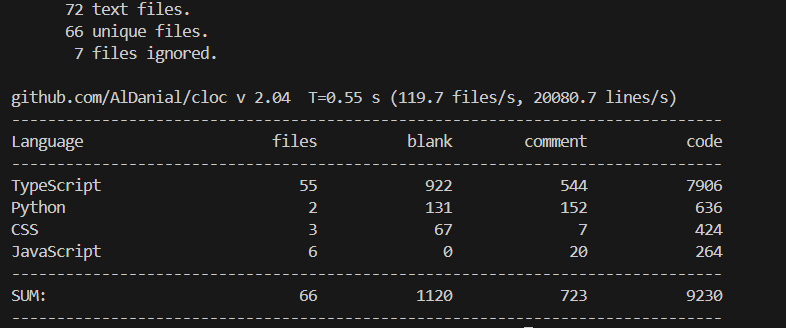
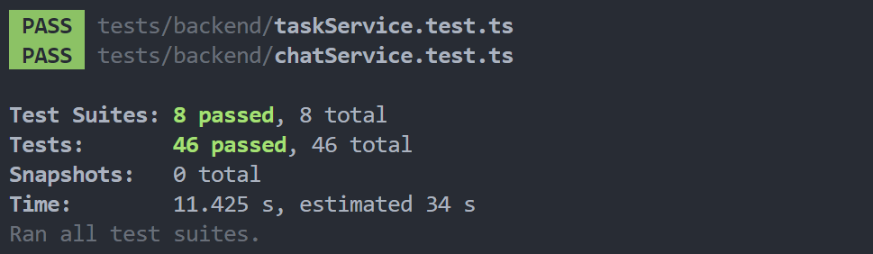

# final-report-team46

# **Metrics**

- Lines of Code（代码行数）and Number of source files

```bash
sudo apt update
sudo apt install cloc

cloc ./src ./vite_test/src ./tests
```



- Cyclomatic Complexity

```bash
pip install lizard
lizard ./src ./vite_test/src ./tests

npm install -g complexity-report
cr -f json -o report.json ./src
```


- Number of dependencies

```bash
npm ls --depth=0
 
npm ls --depth=0 | grep '──' | wc -l
```

```bash
 test-combine@0.0.1 D:\桌面\team-project-25spring-46-f_sprint-merged
 ├── @supabase/supabase-js@2.49.8
 ├── @tailwindcss/typography@0.5.16
 ├── @types/cors@2.8.18
 ├── @types/express@5.0.1
 ├── @types/jest@29.5.14
 ├── @types/node@20.17.46
 ├── @types/pdf-parse@1.1.5
 ├── @types/pg@8.15.1
 ├── @types/supertest@6.0.3
 ├── @types/vscode@1.100.0
 ├── @types/web@0.0.235
 ├── @typescript-eslint/eslint-plugin@8.32.0
 ├── @typescript-eslint/parser@8.32.0
 ├── @vscode/test-cli@0.0.10
 ├── @vscode/test-electron@2.5.2
 ├── axios@1.9.0
 ├── body-parser@2.2.0
 ├── cors@2.8.5
 ├── esbuild@0.25.4
 ├── eslint@9.26.0
 ├── express@5.1.0
 ├── jest@29.7.0
 ├── markdown-it@14.1.0
 ├── npm-run-all@4.1.5
 ├── pdf-parse@1.1.1
 ├── pdf2image@1.2.3
 ├── pdfjs-dist@5.2.133
 ├── pg-protocol@1.10.0
 ├── pg@8.16.0
 ├── react-markdown@10.1.0
 ├── react-modal@3.16.3
 ├── react-syntax-highlighter@15.6.1
 ├── remark-breaks@4.0.0
 ├── remark-gfm@4.0.1
 ├── supertest@7.1.1
 ├── ts-jest@29.3.4
 └── typescript@5.8.3
37
```

# **VS Code 插件使用者手册**

1. 点击左侧图标即可进入登录页面


1. 新用户点击注册进行注册/老用户直接登录即可进入主页面，点击添加课程新建课程


1. 点击课程页面即可看到相关课程，点击PDF即可查看文件，添加评论，并且运行相关代码块


1. 在文件详情页面点击”运行代码识别”按钮可以启动脚本识别当前文件中可能存在的代码块。


1. 点击聊天页面即可进行聊天和添加任务，然后在我的任务中看到任务


1. 在代码运行中即可通过选择本地环境选择代码进行运行


1. 点击右上角的注销退出登录

# **VS Code 插件开发者与前端通信 API 文档**

1. 在根目录下运行"npm install"安装所需的模块

2. 进入vite_test目录，运行"npm install"安装所需的模块

3. 在vite_test目录中运行"npm run dev"可以看见UI Demo（可选）

4. 在vite_test目录中运行"npm run build"会生成dist文件夹，将其复制并覆盖根目录中的dist即可（可选，目前已经覆盖过）

5. 安装src/pdf_test.py中的所需模组，确保可以运行这个脚本

6. 配置src/python_env.ts, 确保其中的python是安装了对应库的python

7. 配置src/database.ts，确保其中的url是自己电脑上的postgresql

8. 使用如下的sql命令在对应的数据库中创建表：

"CREATE TABLE courses (

id SERIAL PRIMARY KEY,

name TEXT NOT NULL,

folder_path TEXT NOT NULL

);"

9. 在根目录下运行npm run compile

10. Run and Debug the extension

11. Control+Shift+p 选择Open Webview即可打开主界面

12. 若要运行AI模块，请打开AISummarizer模块并替换您自己的APIkey

---

## **用户管理**

| **Command** | **参数** | **描述** |
| --- | --- | --- |
| `login` | `email`, `password` | 用户登录验证 |
| `register` | `name`, `email`, `password` | 用户注册 |
| `logout` | 无 | 注销当前用户 |
| `getCurrentUserid` | 无 | 获取当前用户 ID |

## **好友功能**

| **Command** | **参数** | **描述** |
| --- | --- | --- |
| `getUsers` | 无 | 获取所有用户（用于添加好友） |
| `newFriend` | `currentUserId`, `friendId` | 添加好友关系（双向） |
| `getFriendsList` | `userId` | 获取好友列表 |
| `deleteUser` | `userId` | 删除用户（包括好友） |

---

## **群聊管理**

| **Command** | **参数** | **描述** |
| --- | --- | --- |
| `getGroupList` | `userId` | 获取用户加入的群组 |
| `createGroup` | `name`, `userIds[]`, `ownerId` | 创建群聊 |
| `getGroupUsers` | `groupId` | 获取群聊成员 |
| `removeGroupMembers` | `groupId`, `userIds[]` | 删除群聊成员 |
| `getGroupMessages` | `groupId` | 获取群聊消息 |
| `sendGroupMessage` | `sender`, `group_id`, `text` | 发送群消息 |

---

## **私聊功能**

| **Command** | **参数** | **描述** |
| --- | --- | --- |
| `getFriendMessages` | `userId`, `friendId` | 获取私聊消息 |
| `sendFriendsMessage` | `sender`, `receiver`, `text` | 发送私聊消息 |

---

## **评论系统**

| **Command** | **参数** | **描述** |
| --- | --- | --- |
| `addComment` | `filePath`, `comment` 对象 | 添加评论 |
| `deleteComments` | `id` | 删除评论 |
| `getAllComments` | `filePath` | 获取某文件所有评论 |

---

## **任务系统**

| **Command** | **参数** | **描述** |
| --- | --- | --- |
| `createTask` | `title`, `details`, `due_date`, `priority`, `status`, `course_id`, `project_id` | 创建任务 |
| `getMyTasks` | 自动传入当前用户 ID | 获取我的任务 |
| `getProjectTasks` | `projectId` | 获取项目任务 |
| `updateTask` | 同 `createTask` + `id` | 更新任务 |
| `deleteTask` | `taskId` | 删除任务 |

---

## **课程与文件管理**

| **Command** | **参数** | **描述** |
| --- | --- | --- |
| `createCourse` | 用户输入 | 创建新课程 |
| `getCourses` | 无 | 获取课程列表 |
| `getCourseFiles` | `courseName` | 获取课程下的文件 |
| `getFileDetails` | `filePath` | 获取文件详细信息 |
| `getPdfPath` | `path` | 获取文件真实路径 |
| `getDemoPdfPath` | 无 | 获取示例 PDF 路径 |
| `getPdfWorkerPath` | 无 | 获取 PDF Worker 路径 |

---

## **AI 功能**

| **Command** | **参数** | **描述** |
| --- | --- | --- |
| `generateSummary` | `filePath` | AI 生成摘要 |
| `generateSummaryAndSave` | `filePath` | AI 生成摘要并保存为 `.md` 文件 |
| `generateQuiz` | `filePath` | AI 生成测验题 |
| `runCodeRecognition` | `filePath` | 运行 Python 脚本提取代码片段 |

---

## **文件处理**

| **Command** | **参数** | **描述** |
| --- | --- | --- |
| `openFile` | `filePath` | 打开 PDF 并读取 JSON |

## **文件页面交互接口**

| **Command** | **来源方法** | **参数** | **描述** |
| --- | --- | --- | --- |
| `getFileDetails` | `useEffect` | `filePath` | 获取文件详细信息 |

---

## **课程交互接口**

| **Command** | **来源方法** | **参数** | **描述** |
| --- | --- | --- | --- |
| `getCourses` | `useEffect` | 无 | 获取课程列表 |
| `getCourseFiles` | `useEffect`, `handleCourseChange` | `courseName` | 获取课程文件列表 |

---

## **展示交互接口**

| **Command** | **来源组件/方法** | **参数** | **描述** |
| --- | --- | --- | --- |
| `getAllComments` | `useEffect` | `filePath` | 周期性获取所有评论 |
| `addComment` | `handleAddComment` | `{ filePath, comment }` | 添加新评论 |

## **PDF交互接口**

| **Command** | **来源方法** | **参数** | **描述** |
| --- | --- | --- | --- |
| `getPdfWorkerPath` | `useEffect` | 无 | 获取 pdf.worker.js 路径 |
| `getPdfPath` | `useEffect` | `path`（即文件路径） | 获取 PDF 真实路径 |

---

## **文件交互接口**

| **Command** | **来源方法** | **参数** | **描述** |
| --- | --- | --- | --- |
| `getCourses` | `useEffect` | 无 | 获取课程列表 |
| `createCourse` | `handleAddCourse` | 无 | 创建新课程 |

---

## **登录交互接口**

| **Command** | **来源方法** | **参数** | **描述** |
| --- | --- | --- | --- |
| `login` | `handleSubmit` | `name`, `email`, `password` | 用户登录 |
| `loginResult` | `handleMessage` | 响应消息中返回用户信息或失败原因 | 登录响应 |

---

## 代码相关接口

| Command | 来源方法 | 参数 | 描述 |
| --- | --- | --- | --- |
| `runCodeBlock` | `handleRunCode` | `code`, `language`, `blockIdx`(pdf文档中)/`environment` (首页的代码编辑器中) | 执行编辑器中的代码并返回运行结果 |
| `runCodeRecognition` | `onclick` | 无 | 执行内置python脚本识别文档中可能的代码块片段 |
| `getAvailableCompilers` | `useEffect`, `onclick` | `language` | 获取当前环境中可用的编译器 |

---

这些组件使用 `vscode.postMessage({ command: '...' })` 向 VS Code 插件发送消息，并通过 `window.addEventListener('message', ...)` 接收结果。消息统一由 `extension.ts` 中的 `onDidReceiveMessage` 进行处理。

# 测试

### 使用的测试技术、工具和框架：

我们项目使用了 **Jest** 作为主要的自动化测试框架，对 `courseService` 模块以及其他各种模块进行了单元测试。通过对文件系统（`fs` 模块）、数据库接口（`src/database`）、以及 VS Code API（如 `vscode.window.showOpenDialog`）进行 mock 操作，实现对以下核心功能的自动测试：

- `getCourses`: 测试数据库返回的课程信息。
- `getCourseSubfolderFiles`: 测试读取课程子文件夹中的文件。
- `getFileDetails`: 测试文件详情（类型、大小、子文件夹路径）提取逻辑。
- `getFileAbsolutePath`: 测试路径拼接逻辑。
- `createNewCourse`: 测试在未选择文件夹时的错误处理逻辑。

### 测试源码链接或截图：

测试代码文件位于：`tests/backend/`




# 构建

### 使用的构建工具和技术：

我们采用了以下技术和工具来实现自动化构建流程：

- **TypeScript (`tsc`)**：用于将 TypeScript 源代码编译为 JavaScript。
- **npm scripts**：用于定义和执行构建任务（如 `compile`, `lint`, `test`, `package`）。
- **ESLint**：静态代码检查，提升代码质量。
- **Jest**：用于执行测试任务，集成到构建流程中。
- **vsce (Visual Studio Code Extension CLI)**：用于打包 VS Code 插件（可通过命令 `npx vsce package` 打包生成 `.vsix` 文件）。

### 构建流程中执行的任务：

在构建过程中执行了以下任务：

1. **编译源代码**
    - 命令：`npm run compile`
    - 使用 TypeScript 编译器将 `src` 中的源码转化为 `out/extension.js` 等执行文件。
2. **打包插件**
    - 命令：`npm run vscode:prepublish`（内部运行 `npm run package` → `npm run compile`）
    - 用于打包扩展以发布至 VS Code Marketplace。
3. **静态代码分析**
    - 命令：`npm run lint`
    - 使用 ESLint 对源码进行规范检查，确保代码一致性和可维护性。
4. **运行测试**
    - 命令：`npm run test:backend`
    - 使用 Jest 框架运行后端测试，保障功能正确性。

该构建流程确保代码从开发到交付具备自动化、可靠性和可维护性。

总流程：build.bat


# **部署**

### 使用的部署技术和方式：

由于本项目为 **Visual Studio Code 插件**，不适用于传统的 Web 服务或后端系统的容器化部署。我们使用如下现代工具和流程完成插件部署：

- **VSCE (Visual Studio Code Extension CLI)**：官方推荐工具，用于将插件打包成 `.vsix` 文件。
- **GitHub**：项目托管在 GitHub 上，便于团队协作和版本管理。
- **Visual Studio Code Marketplace**：支持将插件发布至官方插件市场。
- **命令行安装**：也支持用户通过 `.vsix` 文件手动安装插件，适用于本地部署或调试。

### ✅ 部署脚本示例：

```bash
npm install -g @vscode/vsce
vsce package
```

我们已成功打包并安装插件，以下为终端成功打包

```
Created: test-combine-0.0.1.vsix
```

